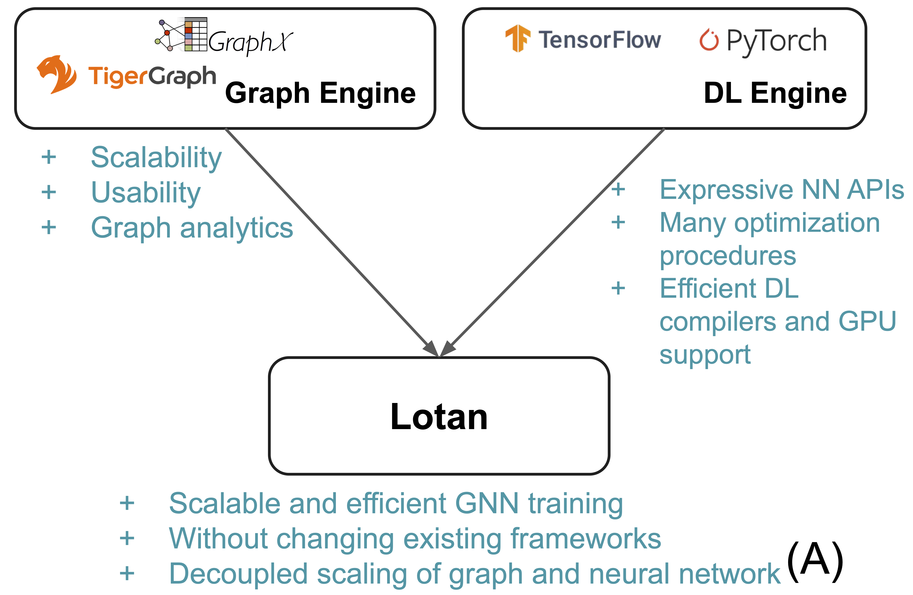
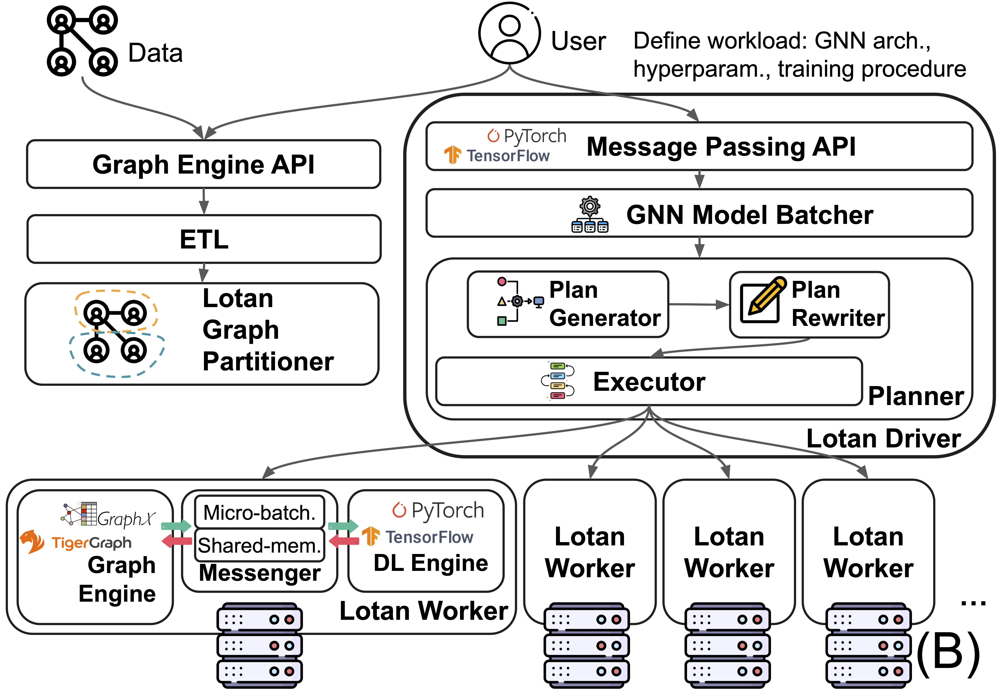

# Lotan

This repo contains the code and artifacts for our paper *Lotan: Bridging the Gap between GNNs and Scalable Graph Analytics Engines* published at VLDB 2023. Links: [Project Website](https://adalabucsd.github.io/cerebro.html) [Paper PDF](https://adalabucsd.github.io/papers/2023_Lotan_VLDB.pdf), [Tech Report](https://adalabucsd.github.io/papers/TR_2023_Lotan.pdf), [Blog Post](https://adalabucsd.github.io/research-blog/lotan.html).

## Introduction

<p align="center">
  
&nbsp; &nbsp; &nbsp; &nbsp;
  
</p>

Lotan is a scalable distributed full-graph Graph Neural Network training system with the amazing scalability and capability of handling models on huge graphs with large embedding sizes, running deep 16-layer models, and huge models with 140M+ parameters, all without crashing (see our paper for details). Our system is built on top of existing graph analytical and deep learning systems, in contrast to the vast majority of custom-built GNN systems. We employ graph systems for graph challenges and DL systems for DL challenges. This divide-and-conquer approach can combine the benefits from both worlds and provide the **decoupling of graph and neural networks**, analogous to the famous **decoupling of compute and storage**. The graph and NN components can now scale independently of each other, allowing for much greater GNN model design freedom.

This is the prototype we built based on Spark GraphX and PyTorch, with a feat of technical novelties and engineering efforts to make it as efficient and scalable as possible without modifying the codebase of either GraphX or PyTorch. Furthermore, such an architecture allows the user to run GNNs directly from their Graph DB, and the system can piggy pack all the useful functionalities such as fault tolerance, general data management capabilities, and transactions that a mature graph data system can offer. Check our paper to see the details of all the innovations, including Planner Optimization, GNN-centric Graph Partitioning, GNN Model Batching, and many more.


## Prerequisites

**Spark and HDFS:** Lotan is a distributed system working on top of Apache Spark and PyTorch DDP. Therefore, Spark `>= 3.2.0` and HDFS must be installed and enabled. We only tested Spark with 3.2.0 version, and compatibilities with other versions are unknown.

**NFS and keyless SSH:** It is highly recommended to put this project folder in an NFS or other shared filesystem accessible from the entire cluster. Further, keyless SSH must be set up in the cluster. There are a few good guides, for instance, [this one](https://kb.rice.edu/page.php?id=108596).

**Python, Java, and Scala:** On the other hand, a `python >= 3.8`  along with `jdk == 8` and `scala == 2.12` environment needs to be set up on every node; you can use the following:

```bash
# install all debian packages
bash setup.sh

# add dynamic library path to spark workers
echo "export LD_LIBRARY_PATH=/usr/local/lib" | tee -a $SPARK_HOME/conf/spark-env.sh

# install all prepherial pythonlibs
pip install -r requirements_master.txt

# pytorch, modify according to your cuda version
pip install torch==1.10.2 torchvision==0.11.3 torchaudio==0.10.2 --extra-index-url https://download.pytorch.org/whl/cu113


# ogb
pip install ogb
# torch-scatter and torch-sparse, for DGL
pip install torch-scatter -f https://data.pyg.org/whl/torch-1.10.2+cu113.html
pip install torch-sparse -f https://data.pyg.org/whl/torch-1.10.2+cu113.html

# dgl
pip install dgl-cu113==0.9.1.post1 dglgo -f https://data.dgl.ai/wheels/repo.html


```

Also, if you do not already have Scala and SBT, use the following.

```bash
# Sdk and scala
curl -s "https://get.sdkman.io" | bash
source ~/.sdkman/bin/sdkman-init.sh
sdk install scala 2.12.15
sdk install sbt
```

**Important global vars**:

Lotan requires each machine to be labeled with global variables; you need to run the following to give each host a permanent name and number:

```bash
echo "WORKER_NUMBER=<number you give, eg: 1>" | sudo tee -a /etc/environment
echo "WORKER_NAME=<name you give, eg: worker1>" | sudo tee -a /etc/environment
source /etc/environment
```

Then, modify the relevant constants in `constants.sh`:

```bash
SIZE=<number of computational nodes in the cluster>
HOSTS=<path to a hosts file contains all worker nodes ip addresses, one ip per line>
# the file should look like
10.0.1.2
10.0.1.3
...

HOSTS_ALL=<same to above, except also with the master node ip>
# the file should look like
10.0.1.1
10.0.1.2
10.0.1.3
...

master_ip=<master node ip address>

export LOTAN_NFS_ROOT="/mnt/lotan" # the directory of lotan repo on nfs

LOG_DIR="<log root directory, preferably on a NFS>/$TIMESTAMP"

MODEL_DIR="<model checkpoint directory, preferably on a NFS>/$TIMESTAMP"
```

Also modify the configurations located in `graphp/src/main/scala/Constants`:

```scala
// directory to lotan root
val LOTAN_NFS_ROOT = "/mnt/lotan/"
// modify this to be your spark master's ip
val MASTER = "10.10.1.1"
// modify this to the list of IP addresses of your workers
val hosts = Seq(
        "10.10.1.1",
        "10.10.1.2",
        "10.10.1.3",
        "10.10.1.4",
        "10.10.1.5",
        "10.10.1.6",
        "10.10.1.7",
        "10.10.1.8"
    )
// the full path to the python you are using
val DGL_PY = "/mnt/env_dgl/bin/python3.8"
```

(Optional), you can also modify the intermediate files store path in `gsys/constants.py:constants`. 

```python
class constants(Constants):
    ...
    DGL_DATASET_DIR = '/mnt/nfs/datasets'
    NFS_ROOT = '/mnt/nfs/ssd'
    ...
```


## Installation

The Lotan project comes in two parts: one part is in Scala using GraphX, and the other part is in Python using PyTorch. The Python part needs to be installed, and the Scala part needs to be compiled. 

**Python part:** Install the python package:

```bash
pip install -e .
```

**Scala part:** Compile the scala lib to .jar (this step is included in the bash script below, so you don't actually have to do this):

```bash
cd graphp
# install sbt for scala first
sbt assembly
```

## Usage

### Set system parameters

Configure a few system parameters in `run_mb.sh`: 

```bash
spark_worker_cores=<each cluster node's number of CPU cores>
numEParts=<number of edge partitions in graphx>
numVParts=<number of vertex partitions>
```
Set alias to `python`:

```bash
export DGL_PY=python
```

### Set model hyperparameters
Modify the GNN hyperparameter search grid if you want at `gsys/constants.py:65`; at the moment, it only supports optimizer in `{adam, adagrad}`, learning rate, and drop-out rate. The models implemented include GCN and GIN. More models can be implemented under the same framework, see `gsys/nn.py` for examples.


### Quick start: run model training
To launch a Lotan training task, use `run_example.sh` script from your master node to run both the GraphX job and PyTorch job. 

```bash
bash run_example.sh
```
This will train a 3-layer GCN model on the OGBN-arxiv dataset. More advanced usages are in the comments.

Running this command will automatically set up the python workers and messengers on every worker host. The prompt will be switched to Spark. This will also print out a command like

```bash
tail -f /mnt/nfs/logs/run_logs/xxx/server/$WORKER_NAME.log
```

Run this command on every host to monitor the model's training info in real-time.

Full usage of the `run_mb.sh` script:

```bash
bash run_mb.sh <optional log root> <num of epochs to train> <num of workers> <model-related configs> <number of model layers>

For the <model-related configs>, refer to gsys/all_args.py.
```

### Use your own dataset

You can run Lotan on your own dataset as long as you can convert it into the DGL format. For details, refer to `dgl_to_spark_data.py` and follow the code path there. It is fairly simple as you only need to plug the DGL object into the `read_node_dataset` in `gsys/data.py`.


### Terminate processes

Sometimes the processes may not gracefully exit, to terminate all of them, run the following on every host:

```bash
pkill -f server_main.py; pkill -f pipe.py
```

